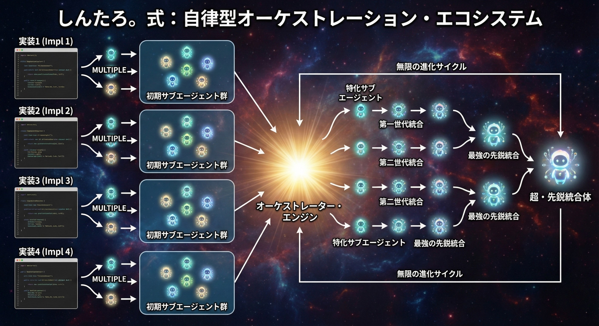

# Autonomous Orchestration Ecosystem

A self-evolving sub-agent management system for Claude Code. Instead of using pre-defined abstract agents, let the orchestrator dynamically create, integrate, and evolve agents based on actual task requirements.

> **Original concept by [@shintaro_sprech](https://x.com/shintaro_sprech)**



## Concept

The system implements an **Infinite Evolution Cycle**:

```
Implementation → Initial Sub-agent Pool → Orchestrator Engine
                                              ↓
                                    Specialized Sub-agents
                                              ↓
                                    1st Gen Integration
                                              ↓
                                    2nd Gen Integration
                                              ↓
                                    Hyper-Elite Integration
                                              ↓
                                    Ultimate Elite Integration
                                              ↓
                                    Hyper-Elite Integrated Entity
                                              ↓
                                    ← Infinite Evolution Cycle →
```

## Key Features

- **Task-driven agent creation**: Agents are born from real task requirements, not abstract definitions
- **Dynamic integration**: Merges agents when synergy improves outcomes
- **Continuous evolution**: Strong agents evolve through generations, weak ones fade
- **Elite promotion**: High-performing agents are promoted to elite status
- **Lineage tracking**: Integrated agents remember their parents, enabling evolution chains

## How It Works

### 1. Task Analysis

When a task is received, the orchestrator:
- Scans the existing agent pool
- Calculates coverage rate against task requirements

### 2. Decision Matrix

| Coverage Rate | Action |
|---------------|--------|
| **90%+** | Use existing agent directly |
| **60-90%** | Create integrated agent from multiple sources |
| **Below 60%** | Create new specialized agent |

### 3. Evolution Tracking

After task completion:
- Update agent metrics (usage_count, success_rate)
- Promote high-performers to elite status

## Directory Structure

```
your-project/
├── .claude/
│   ├── settings.json          # Hooks for orchestration
│   └── agents/
│       ├── orchestrator.md    # Orchestrator definition
│       ├── _template.md       # New agent template
│       ├── manifests/         # Skill sheets (metadata + metrics)
│       │   └── {agent}.yaml
│       └── pool/              # Agent pool
│           ├── specialized/   # Task-specific agents
│           ├── integrated/    # Merged agents (1st/2nd Gen)
│           └── elite/         # Hyper-Elite agents
└── CLAUDE.md                  # Orchestration rules
```

## Quick Start

### 1. Copy files

```bash
cp -r .claude /path/to/your/project/
```

### 2. Add to CLAUDE.md

Add the content from `CLAUDE.md` to your project's CLAUDE.md:

```markdown
## Agent Orchestration

**Must**: All tasks must pass through the orchestrator workflow before execution.

### Core Principle

**Do NOT use pre-defined abstract agents.** Instead:
1. Create specialized agents from actual task requirements
2. Integrate existing agents when synergy improves outcomes
3. Let the agent pool evolve through continuous improvement
```

### 3. Start using

When you give Claude Code a task:
1. Orchestrator scans `pool/` for existing agents
2. Calculates coverage against task requirements
3. Creates/integrates/selects the optimal agent
4. Executes task
5. Updates metrics in `manifests/`
6. Promotes high-performers to `elite/`

## Example Evolution

**First task**: "Create a REST API endpoint for user authentication"
```
Orchestrator: No existing agents → Create specialized agent
→ Saved: pool/specialized/auth-api-specialist.md
→ Created: manifests/auth-api-specialist.yaml
```

**Second task**: "Add database validation to the auth API"
```
Orchestrator: auth-api-specialist (70%) + need DB skills
→ Create integrated agent
→ Saved: pool/integrated/merged-auth-db.md
→ Created: manifests/merged-auth-db.yaml (parent_agents: [auth-api-specialist])
```

**After 5+ successful tasks with 80%+ success rate**:
```
Orchestrator: merged-auth-db qualifies for elite
→ Moved: pool/integrated/merged-auth-db.md → pool/elite/merged-auth-db.md
→ Updated: manifests/merged-auth-db.yaml (tier: elite)
```

## Documentation

- [Concept Details](docs/concept.md) - Design philosophy and evolution mechanics
- [Quick Start](docs/quickstart.md) - Setup instructions
- [Advanced](docs/advanced.md) - Customization and team operations

## License

MIT License

## Author

Original concept by [@shintaro_sprech](https://x.com/shintaro_sprech)
