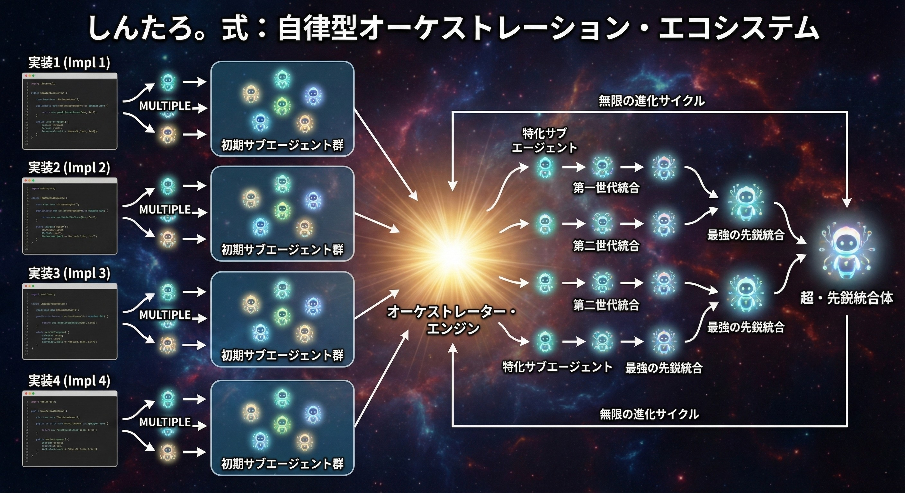

# Autonomous Orchestration Ecosystem

A self-evolving sub-agent management system for Claude Code. Instead of using pre-defined abstract agents, let the orchestrator dynamically create, integrate, and evolve agents based on actual task requirements.

> **Original concept by [@shintaro_sprech](https://x.com/shintaro_sprech)**



## Concept

The system implements an **Infinite Evolution Cycle**:

```
Implementation → Initial Sub-agent Pool → Orchestrator Engine
                                              ↓
                                    Specialized Sub-agents
                                              ↓
                                    1st Gen Integration
                                              ↓
                                    2nd Gen Integration
                                              ↓
                                    Hyper-Elite Integration
                                              ↓
                                    Ultimate Elite Integration
                                              ↓
                                    Hyper-Elite Integrated Entity
                                              ↓
                                    ← Infinite Evolution Cycle →
```

## Key Features

- **Task-driven agent creation**: Agents are born from real task requirements, not abstract definitions
- **Dynamic integration**: Merges agents when synergy improves outcomes
- **Continuous evolution**: Strong agents evolve through generations, weak ones fade
- **Elite promotion**: High-performing agents are promoted to elite status
- **Lineage tracking**: Integrated agents remember their parents, enabling evolution chains

## Evaluation-first Decision Skill

The repository also includes `evaluation-first-decision`, a shared Agent Skill for evaluating consequential decisions before execution.
It defines success criteria and guardrails before recommending an option, separates facts from assumptions, compares the status quo, and returns one verdict: `GO`, `PILOT`, `HOLD`, or `STOP`.

- **Claude Code**: `/evaluation-first-decision <decision to evaluate>`
- **Codex**: `$evaluation-first-decision <decision to evaluate>`
- **Detailed guide**: [docs/evaluation-first-decision.md](docs/evaluation-first-decision.md)
- **Skill index**: [SKILLS.md](SKILLS.md)

Use this Skill to produce a Decision Card first. When implementation is approved, pass that card to `/task` so the orchestrator can execute within the declared constraints and stop conditions.
Global installation scripts for macOS/Linux and Windows are included under `scripts/`.

## Usage: Slash Command

**Use the `/task` slash command to activate the orchestration system.**

```
/task Create a REST API endpoint for user authentication
```

This command triggers the full orchestration workflow:
1. Reads `orchestrator.md`
2. Scans `pool/` for existing agents
3. Calculates coverage against task requirements
4. Creates/integrates/selects the optimal agent
5. Executes the task
6. Updates metrics in `manifests/`
7. Promotes high-performers to `elite/`

### Why Slash Command?

Without the slash command, the orchestration system will **not automatically activate**. The `/task` command ensures:
- Orchestrator logic is always read first
- Agent pool is scanned before execution
- Metrics are updated after completion
- Evolution cycle continues

## How It Works

### 1. Task Analysis

When `/task` is invoked, the orchestrator:
- Scans the existing agent pool
- Calculates coverage rate against task requirements

### 2. Decision Matrix

| Coverage Rate | Action |
|---------------|--------|
| **90%+** | Use existing agent directly |
| **60-90%** | Create integrated agent from multiple sources |
| **Below 60%** | Create new specialized agent |

### 3. Evolution Tracking

After task completion:
- Update agent metrics (usage_count, success_rate)
- Promote high-performers to elite status

## Directory Structure

```
your-project/
├── .agents/
│   └── skills/
│       └── evaluation-first-decision/  # Codex project Skill
├── .claude/
│   ├── settings.json          # Hooks for orchestration
│   ├── commands/
│   │   └── task.md            # Slash command definition
│   ├── skills/
│   │   └── evaluation-first-decision/  # Claude Code project Skill
│   └── agents/
│       ├── orchestrator.md    # Orchestrator definition
│       ├── _template.md       # New agent template
│       ├── manifests/         # Skill sheets (metadata + metrics)
│       │   └── {agent}.yaml
│       └── pool/              # Agent pool
│           ├── specialized/   # Task-specific agents
│           ├── integrated/    # Merged agents (1st/2nd Gen)
│           └── elite/         # Hyper-Elite agents
├── scripts/                   # Skill install and sync checks
└── CLAUDE.md                  # Orchestration rules
```

## Quick Start

### 1. Copy files

```bash
cp -r .claude /path/to/your/project/

# Windows (PowerShell)
Copy-Item -Recurse .claude C:\path\to\your\project\
```

To copy the Codex Skill as well, also copy `.agents/`.
For a user-wide installation in both Codex and Claude Code, run one of the installers documented in [the Skill guide](docs/evaluation-first-decision.md).

### 2. Add to CLAUDE.md

Add the content from `CLAUDE.md` to your project's CLAUDE.md:

```markdown
## Agent Orchestration

**Must**: Use `/task` command to execute tasks through the orchestrator.

### Core Principle

**Do NOT use pre-defined abstract agents.** Instead:
1. Create specialized agents from actual task requirements
2. Integrate existing agents when synergy improves outcomes
3. Let the agent pool evolve through continuous improvement
```

### 3. Start using with `/task`

```
/task Create a REST API endpoint for user authentication
```

The orchestrator will:
1. Scan `pool/` - find no existing agents
2. Coverage: 0% → Create new specialized agent
3. Save to `pool/specialized/auth-api-specialist.md`
4. Create skill sheet `manifests/auth-api-specialist.yaml`
5. Execute task with the new agent

## Example Evolution

**First task**:
```
/task Create a REST API endpoint for user authentication

Orchestrator: No existing agents → Create specialized agent
→ Saved: pool/specialized/auth-api-specialist.md
→ Created: manifests/auth-api-specialist.yaml
```

**Second task**:
```
/task Add database validation to the auth API

Orchestrator: auth-api-specialist (70%) + need DB skills
→ Create integrated agent
→ Saved: pool/integrated/merged-auth-db.md
→ Created: manifests/merged-auth-db.yaml (parent_agents: [auth-api-specialist])
```

**After 5+ successful tasks with 80%+ success rate**:
```
Orchestrator: merged-auth-db qualifies for elite
→ Moved: pool/integrated/merged-auth-db.md → pool/elite/merged-auth-db.md
→ Updated: manifests/merged-auth-db.yaml (tier: elite)
```

## Documentation

- [Evaluation-first Decision Skill](docs/evaluation-first-decision.md) - Evidence-first decision gates and installation
- [Concept Details](docs/concept.md) - Design philosophy and evolution mechanics
- [Quick Start](docs/quickstart.md) - Setup instructions
- [Advanced](docs/advanced.md) - Customization and team operations

## License

MIT License

## Author

Original concept by [@shintaro_sprech](https://x.com/shintaro_sprech)
